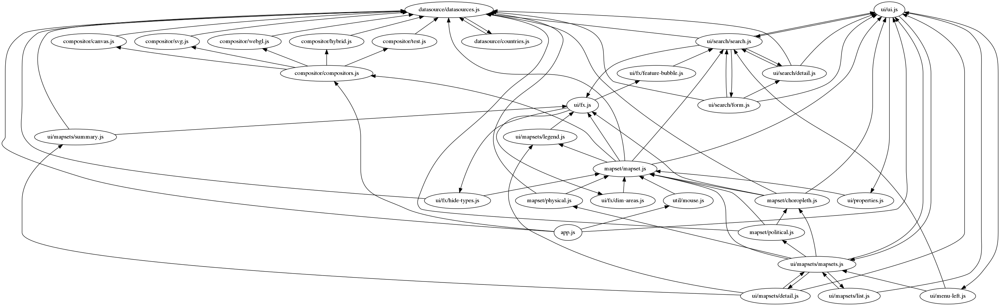

# rollup-plugin-graph

Generates module dependencies graph, using the DOT language. To actually draw images, you will need the `graphviz` toolbox.

In your `rollup.config.js`:
```js
let graph = require("rollup-plugin-graph");
let graphOptions = {prune: true};

module.exports = {
    /* ... */
    plugins: [ graph(graphOptions) ]
};
```

In your terminal:
```sh
rollup -c | dot -Tpng > graph.png
```

## Options

  * `prune` (bool) Whether to prune the resulting graph, leaving only cyclic dependencies. This makes the graph [strongly connected](https://en.wikipedia.org/wiki/Strongly_connected_component).
     Examples: [pruned](https://raw.githubusercontent.com/ondras/sleeping-beauty/master/graphs/pruned.png), [not pruned](https://raw.githubusercontent.com/ondras/sleeping-beauty/master/graphs/complete.png)
  * `exclude` (string or regexp) Specified the module ID pattern to be excluded from the graph.

## Sample output



Please note that this plugin is not directly responsible for image rendering. It generates output in the [DOT language](https://en.wikipedia.org/wiki/DOT_(graph_description_language)), so you need to use a proper tool (such as [Graphviz](https://www.graphviz.org/)) to create the image. 
